# Article Extraction Architecture Diagrams

This document contains visual diagrams explaining the article extraction architecture using Mermaid syntax. These diagrams are rendered automatically on GitHub and many Markdown viewers.

## 1. High-Level System Flow

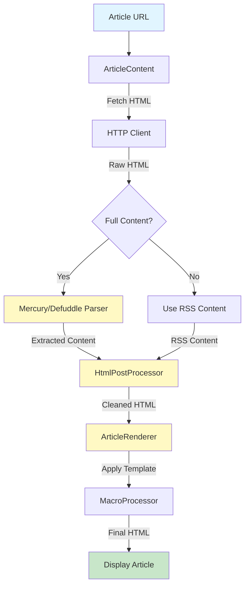

## 2. ArticleContent Flow

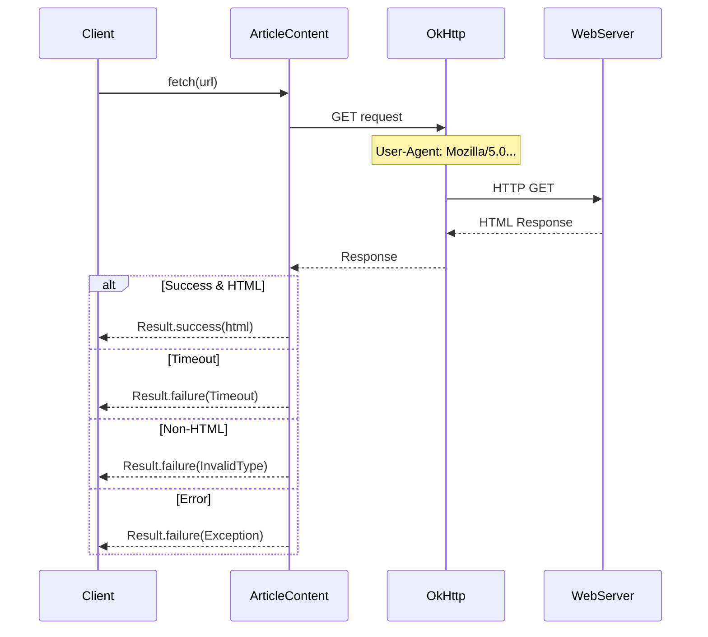

## 3. HTML Processing Pipeline

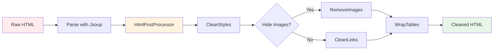

## 4. Image Processing Detail

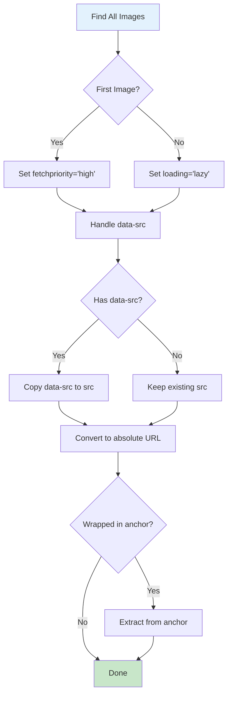

## 5. Mercury Parser Integration

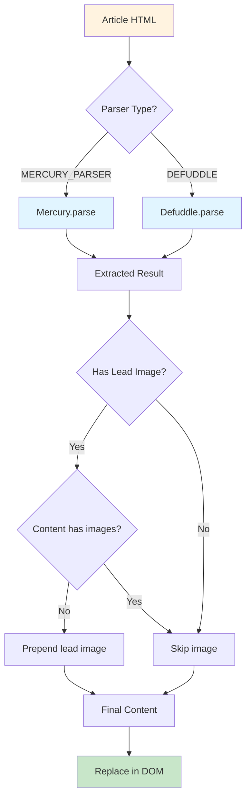

## 6. Template Rendering Process

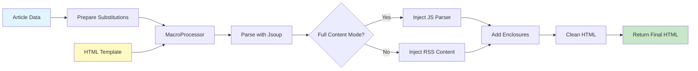

## 7. MacroProcessor Algorithm

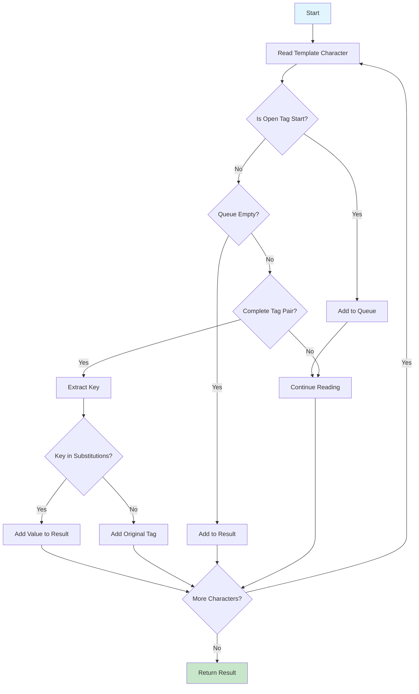

## 8. Component Dependencies

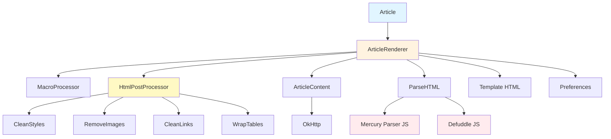

## 9. Error Handling Flow

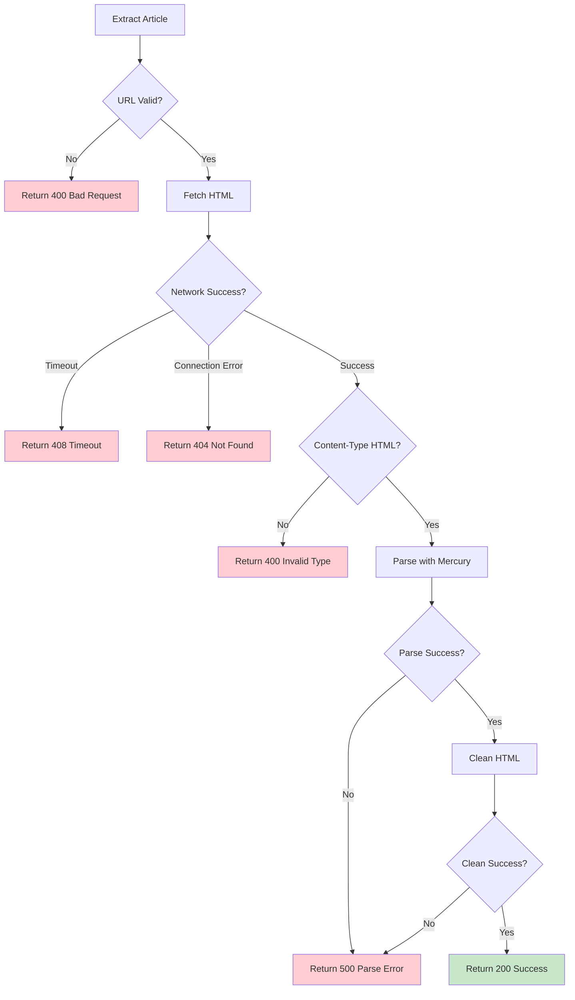

## 10. Data Model Relationships

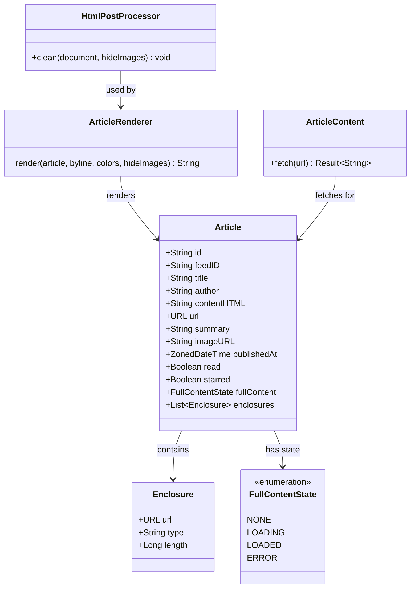

## 11. Complete System Architecture

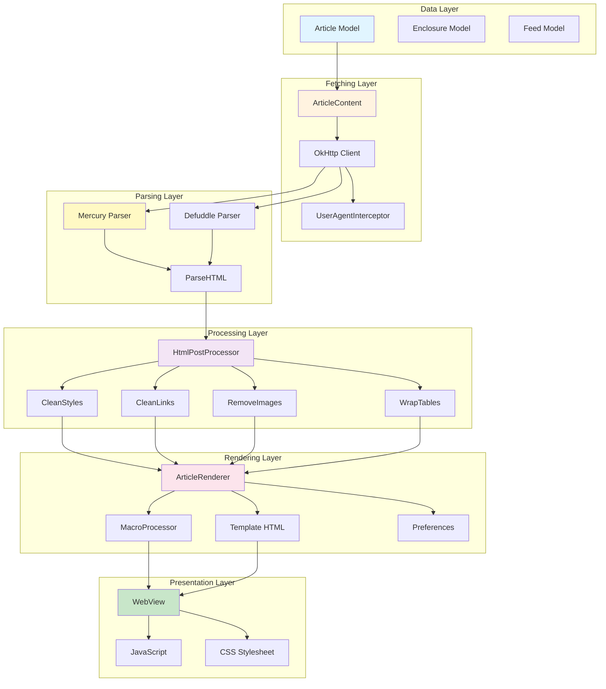

## Diagram Usage

These diagrams can be:
1. **Viewed on GitHub** - Automatically rendered in the README
2. **Copied to documentation** - Use in your own docs
3. **Modified** - Edit the Mermaid syntax to customize
4. **Exported** - Use Mermaid live editor to export as PNG/SVG

## Mermaid Resources

- [Mermaid Official Docs](https://mermaid.js.org/)
- [Mermaid Live Editor](https://mermaid.live/)
- [GitHub Mermaid Support](https://github.blog/2022-02-14-include-diagrams-markdown-files-mermaid/)

---

**Tip:** Copy these diagrams into your own documentation or use them as reference when implementing the extraction logic!
